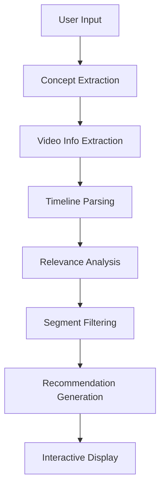

# 🎯 WeVid - AI-Powered Podcast Analyzer

A personalized podcast analyzer that uses AI to extract relevant video segments based on your learning interests. Built with Next.js, OpenAI/Gemini, and AssemblyAI.

## ✨ Features

- **🎥 YouTube Video Analysis**: Extract and analyze video content from YouTube URLs
- **🧠 AI-Powered Concept Extraction**: Uses OpenAI GPT or Google Gemini to understand your learning intent
- **⏰ Timeline-Based Analysis**: Parses video descriptions to identify relevant segments
- **📺 Embedded Video Players**: Watch recommended segments directly in the interface
- **🔄 Real-time Progress**: Live updates during analysis process
- **🎯 Smart Matching**: Advanced relevance scoring for accurate recommendations
- **🎙️ AssemblyAI Integration**: Rich audio analysis with sentiment, entities, and highlights
- **📊 Comprehensive Insights**: Detailed transcript analysis with confidence scores
- **🔍 Semantic Analysis**: Advanced concept matching beyond simple keyword search

## 🚀 Quick Start

### Prerequisites

- Node.js 18+ 
- npm or yarn
- API keys for OpenAI, Google Gemini, and AssemblyAI

### Installation

1. **Clone the repository**
   ```bash
   git clone https://github.com/Mingxiao300/WeVid.git
   cd WeVid
   ```

2. **Install dependencies**
   ```bash
   npm install
   ```

3. **Set up environment variables**
   ```bash
   cp .env.example .env.local
   ```
   
   Edit `.env.local` and add your API keys:
   ```env
   OPENAI_API_KEY=your_openai_api_key_here
   GEMINI_API_KEY=your_gemini_api_key_here
   ASSEMBLYAI_API_KEY=your_assemblyai_api_key_here
   ```

4. **Start the development server**
   ```bash
   npm run dev
   ```

5. **Open your browser**
   Navigate to [http://localhost:3001](http://localhost:3001)

## 🔑 API Keys Setup

### Required Services

1. **OpenAI API** - For GPT models
   - Get your key from: [OpenAI Platform](https://platform.openai.com/api-keys)
   - Used for: Concept extraction and relevance analysis

2. **Google Gemini API** - For Gemini models  
   - Get your key from: [Google AI Studio](https://makersuite.google.com/app/apikey)
   - Used for: Alternative LLM analysis

3. **AssemblyAI API** - For speech-to-text
   - Get your key from: [AssemblyAI Dashboard](https://www.assemblyai.com/dashboard/signup)
   - Used for: Audio transcription

## 🎮 How to Use

1. **Enter a YouTube URL** - Paste any YouTube video link
2. **Select AI Model** - Choose between OpenAI GPT or Google Gemini
3. **Describe Your Interests** - Write what you want to learn about
4. **Get Recommendations** - Receive personalized video segment recommendations
5. **Watch Embedded Videos** - Click to watch segments directly in the interface

### Example Usage

**Input:**
- URL: `https://www.youtube.com/watch?v=qbvY0dQgSJ4`
- Model: `OpenAI GPT`
- Interests: `"I want to learn about reinforcement learning from human feedback (RLHF) and how it's used to train AI models"`

**Output:**
- Extracted concepts: `["reinforcement learning from human feedback", "RLHF", "AI model training"]`
- Recommended segments with relevance scores
- Embedded video players for each recommendation

## 🏗️ Architecture

### Frontend
- **Next.js 14** - React framework with App Router
- **Tailwind CSS** - Utility-first CSS framework
- **TypeScript** - Type-safe development

### Backend
- **Next.js API Routes** - Serverless API endpoints
- **Timeline Analyzer** - Core analysis engine
- **Video Info Extractor** - YouTube metadata parsing

### AI Integration
- **OpenAI GPT-3.5 Turbo** - Primary LLM for analysis
- **Google Gemini Pro** - Alternative LLM option
- **AssemblyAI** - Speech-to-text transcription

### Key Components

```
lib/
├── timeline-analyzer.ts    # Core analysis engine
└── types.ts               # TypeScript interfaces

app/
├── api/
│   ├── analyze-timeline/  # Main API endpoint
│   └── analyze/          # Legacy API endpoint
├── page.tsx               # Main UI component
└── layout.tsx             # App layout
```

## 🔧 Development

### Available Scripts

```bash
npm run dev      # Start development server (port 3001)
npm run build    # Build for production
npm run start    # Start production server
npm run lint     # Run ESLint
```

### Project Structure

```
WeVid/
├── app/                    # Next.js App Router
│   ├── api/               # API routes
│   ├── page.tsx           # Main page
│   └── layout.tsx         # Root layout
├── lib/                    # Core libraries
│   ├── timeline-analyzer.ts
│   └── types.ts
├── .env.example           # Environment template
├── .gitignore             # Git ignore rules
├── LICENSE                # MIT License
└── README.md              # This file
```

## 🧠 How It Works

1. **Concept Extraction**: AI analyzes your interests to extract meaningful learning concepts
2. **Video Analysis**: Extracts video metadata and parses timeline from description
3. **Relevance Scoring**: AI matches concepts with video segments using advanced algorithms
4. **Recommendation Generation**: Filters and ranks segments by relevance
5. **Interactive Display**: Presents results with embedded video players

## 🛠️ Technical Details

### Analysis Pipeline



### Key Features

- **Smart Concept Extraction**: Filters out stop words, focuses on meaningful learning topics
- **Multi-Model Support**: Switch between OpenAI and Gemini models
- **Timeline-Based Analysis**: Uses video descriptions instead of full transcription
- **Real-time Progress**: Live updates during analysis
- **Embedded Video Players**: Direct video segment viewing
- **AssemblyAI Integration**: Rich audio analysis with:
  - Auto-highlights extraction
  - Sentiment analysis
  - Entity detection
  - Content categorization
  - Speaker identification

---

**Built with ❤️ for personalized learning experiences**